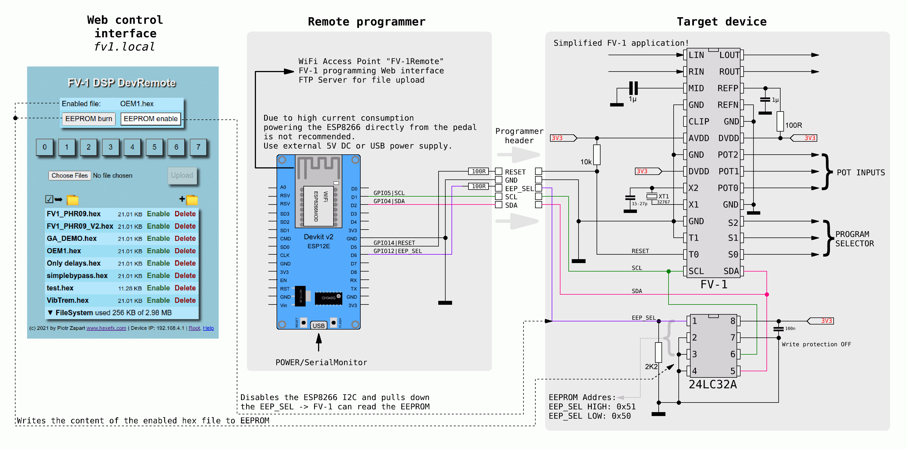
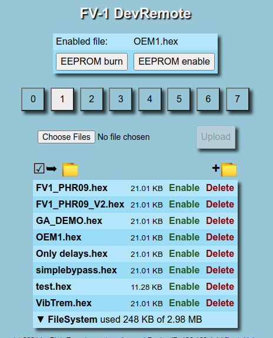
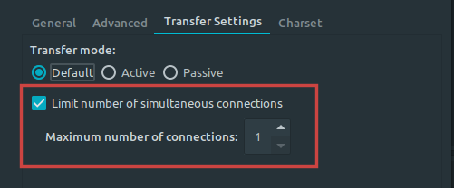
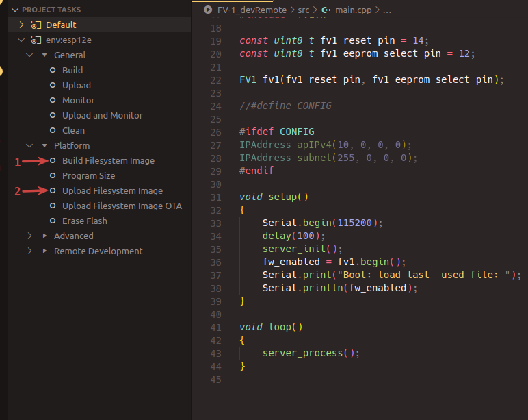

# FV-1_devRemote
### WiFi enabled EEPROM emulator for the SpinSemi FV-1 DSP  
based on inexpensive ESP8266 module and designed to significantly speed up the development process for the Spin Semi FV-1 DSPs. 
Instead of reprogramming the EEPROM memory every time a change in the code is made this device does the following:  
1. Emulates the 24LC32A EEPROM using optimized I2C slave interface.
2. Depending of the FLASH size used in the ESP module, provice a few MB space for compiles SpinAsm hex files. 
3. Provides a web interface for uploading the hex files and selecting one of the 8 programs.
4. For even quicker upload creates an FTP server.
5. Acts as an EEPROM programmer, can write the tested hex file to EEPROM.
6. Can switch between the emulated EEPROM using file system and the internal EEPROM.
7. Creates a WiFi access point **FV1remote**.  

### Basic connections
Four signals + GND are requires to use all the features:  
Programmer | Target FV-1 device
-----------|-------------------
D5/GPIO14/RESET|FV1 T0 pin + 10k pullup resistor
GND|GND
D6/GPIO12/EEP_SEL|Onboard EEPROM A0 pin + 2k2 pull down resistor
D1/GPIO5/SCL|FV-1 SCL
D2/GPIO4/SDA|FV-1 SDA  



* **D5/GPIO14** is used as a reset line to trigger the DSP to reload the firmware. It is connected to the T0 pin on the DSP, which switches between the internal and external program memory. Use 10k pullup resistor on that signal.
*  **D6/GPIO12**  is used to disable/enable the onboard EEPROM. It is done by pulling the A0 address line high, thus changing the I2C slave address of the memory chip. Once set to 1, it will not respond to the FV-1's requests. ESP8266 can pull that signal low (while disabling it's own I2C) to reenable the onboard EEPROM.  
### Web interface
Once powered up the device will create an access point with the followint credentials:  
* SSID: `FV1remote`  
* Password: `Nadszyszkownik`  
  
The credentials are included in the `server.cpp` file in case you want to change them.  
Once connected to the Wifi, simply open the browser and navigate to  
`fv1.local`  

  
* Use **Choose files** + **Upload** button to upload the hex files.  
* Click on the green :green_square:**Enable** to parse the file and make it available for the FV-1.
* Click on the red :red_square:**Delete** to, as expected, delete the file.
* Click on the file name to download it.
* Click on the buttons 0-7 to trigger the FV-1 to load a patch from the currently enabled hex file.
* **EEPROM burn** button will write the content of the currently enabled hex file into the onboard EEPROM.  
* **EEPROM enable** button can be used to test the onboard EEPROM. It disables the file access and 8 patch buttons.  
### FTP Access
FTP can be used for quicker file access/upload.  
The credentials to log into the FTP server are:  
* User: `fv1`
* Password: `fv1`  

Please note the ESP8266 FTP server can handle a single client only. Make sure the number of connections is limited to one in your FTP client software. For FileZilla use the following settings:  



### Building
Software is written using Platformio + VScode. All external libraries are included in the `lib` folder.  
Depending on the operating system the `platformio.ini` file will require a few adjustments.  
1. Check the Com port for your ESP8266 board, for MacOS and Linux it will be `/dev/ttyUSBx`, for Windows `COMx`, change the values for `upload_port` and `monitor_port` accordingly.  
```   
    ; change accordingly to your operating system (ie COMx for Windows)
    upload_port = /dev/ttyUSB0
    upload_speed = 230400

    ; change accordingly to your operating system (ie COMx for Windows)
    monitor_port = /dev/ttyUSB0
    monitor_speed = 115200
```
2. If you have ready made SpinAsm hex files which you want to add, copy them to the `data` folder.
3. Build and upload the filesystem to the ESP8266 board:  
   
  

4. Build and upload the firmware.  

### Debug
For more debug/verbose information connect the board connect the usb and monitor the serial port.  

### Automatic file upload  
The next step in automating the process is to watch the directory where the output hex files are generated and trigger an automatic upload/enable if a new file appears or an existing file is modified.  
To achieve that a small python script watcher.py is provided in the **scripts** folder.  
```
❯ ./watcher.py --help
usage: watcher.py [-h] [-u URL] [-d DIR] [-v]

FV1 DevRemote auto file uploader. (c) 2021 by Piotr Zapart www.hexefx.com

optional arguments:
  -h, --help         show this help message and exit
  -u URL, --url URL  FV1 DevRemote base url
  -d DIR, --dir DIR  Directory to watch
  -v, --verbose      Verbose mode
```
#### Installation on Linux
1. Install pacakges required by pycurl  
    ```sudo apt install libcurl4-gnutls-dev librtmp-dev```
2. Install python packages:  
    ```python3 -m pip install --user watchdog pycurl```  
#### Installation on Windows  
There is a compiled (using pyinstaller) exe file provided in the scripts folder. Tested on Windows 10.  
Python version installation:  
1. Check which version of python you have installed
2. Go to https://dl.bintray.com/pycurl/pycurl/
    and download compatible pycurl installer, ie.
    for python 3.8 the latest version at the moment is
    pycurl-7.43.0.5.win-amd64-py3.8.exe
3. Install pycurl
4. Install watchdog:
    pip3 install watchdog  
#### Usage  
Simplest way to use the uploader is to copy the `watcher.py` or `watcher.exe` file to the directory where the SpinAsm/SpinCAD files will be generated and executing it in that directory.  
***On Windows***, open the command line and navigate to the hex output directory where the watcher.exe file exists and run it with the following command:  
`watcher.exe --url 192.168.4.1`  
The default url for the FV1 DevRemote board uses mDNS and is `fv1.local`. On Windows however, i experienced problems with resolving the mDNS local addresses using python's pycurl library. Therefore i opted to use the boards IP address, which normally defaults to 192.168.4.1. If you redefined the IP address in your build - use the correct address here.  
If there are still problems, enable the verbose mode to see more detailed info:  
`watcher.exe --url 192.168.4.1 --verbose`  
Another way of more global use would be to add the path to the watcher.exe file to the system enviromental PATH, this way it will be executable from any other directory.  
Having done that, there is no need to copy the watcher.exe file to each scanned hex file folder. Simply execute `watcher.exe` from the command line in that folder.  
***On Linux***, well it's much simpler :)  
Most distributions will automatically add the files placed in the `~/bin/` directory to the PATH. Copy the `watcher.py` file to the ~/bin/, update the PATH `source ~/.profile`, go to the FV1 hex output directory and start the watcher:  
`watcher.py`  
Without any parameters the script will assume the board's url is http://fv1.local. and the watched directory is the one where the script is invoked from.  
Once the file is uploaded and enabled the page should automatically refresh within 1 second.  
Press Ctrl+C to exit the watcher.

### Credits  
The idea for this project sparked in this thread over at diystopmboxes forum:  
https://www.diystompboxes.com/smfforum/index.php?topic=126087.0  

Many thanks to Perttu Haimi for his optimized i2c slave code, which i ported to the ESP8266 adding a timeout feature.  
A stock software i2c slave library for the 8266 wouldn't be able to handle over 250kHz clock rate required by the FV-1 chip, which also depends on the chip sampling rate. This implementation works up to 44.1kHz.  

Most of the web code is based on examples by Jens Fleischer https://fipsok.de  

---
(c) 01.2021 by Piotr Zapart  
www.hexefx.com  
   

